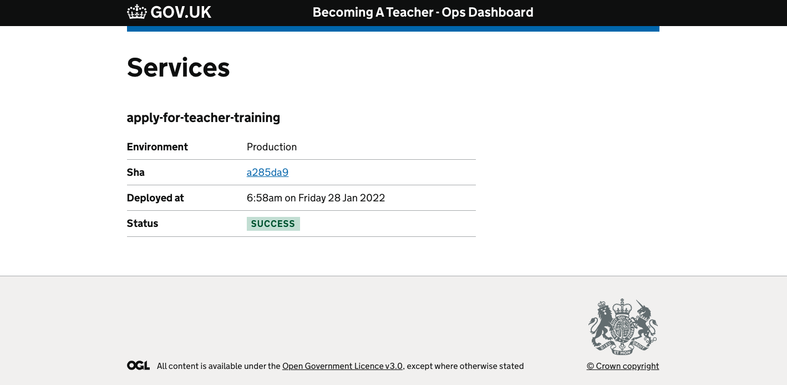

# BAT Ops Dashboard

A dashboard that shows the current deployment status for Becoming A Teacher services.



## Local development

* `GITHUB_TOKEN` is required for api calls to avoid being rate limited.

Once the environment variables are set run the app with:

```bash
foreman start
```

Alternatively you can run with Docker:

```bash
docker build . -t bat-ops-dashboard
docker run -p 3000:3000 bat-ops-dashboard
```

The app will be available on `http://localhost:3000`

## Configuration

At the moment new services can be registered with the app by updating [github.yml](config/github.yml) in the config directory.

A service must be specified under the repositories property and can have one or more environments associated with it.

## Wish list

Here are some things that we would like to add, but haven't yet.

* Deployment status should link to the workflow run
* We should be able to diff between the current version and previous
* Add a deploy freeze button
